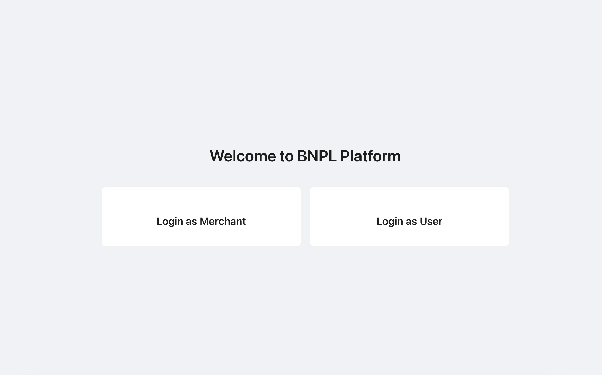
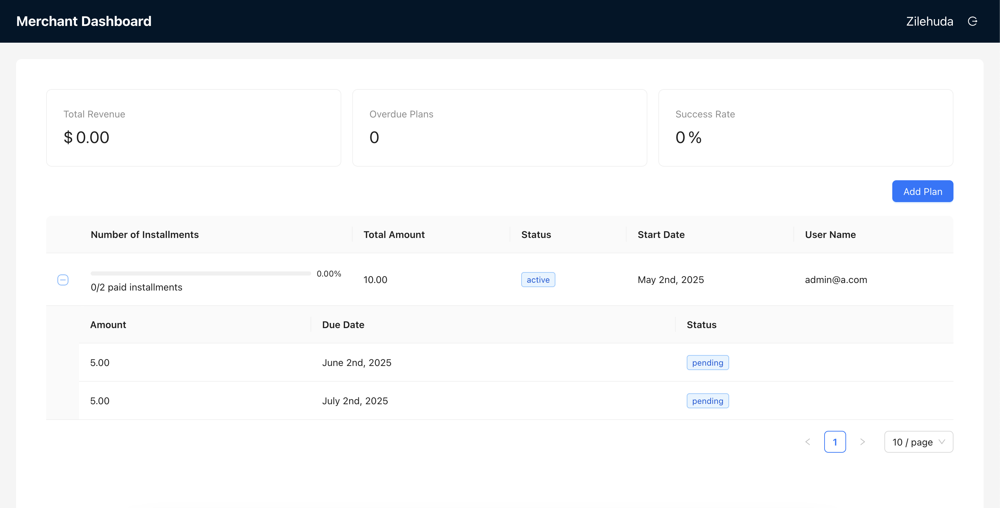
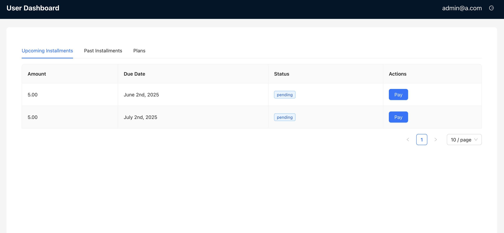

# BNPL Frontend

This is the frontend is for BNPL

## Tech Stack

- Framework: [React.js](https://reactjs.org/)
- Design: antd
- Routing: React Router
- API Integration: Axios

## Setup Instructions

1. **Clone the repository**
   ```bash
   git clone https://github.com/zilehuda/bnpl-frontend.git
   cd bnpl-frontend
   ```
2. **Install dependencies**
    ```
    npm install
    ```
3. **Setup .env**
Create `.env` file and provide `REACT_APP_API_BASE_URL`

4. **Run app**
    ```
    npm run start
    ```


## 📸 Screenshots

### 🏠 Home Page



### Merchant Dashboard



### User Dashboard




### Trade-off
- Right now, after adding a new plan, we have to refresh to show it on table.
